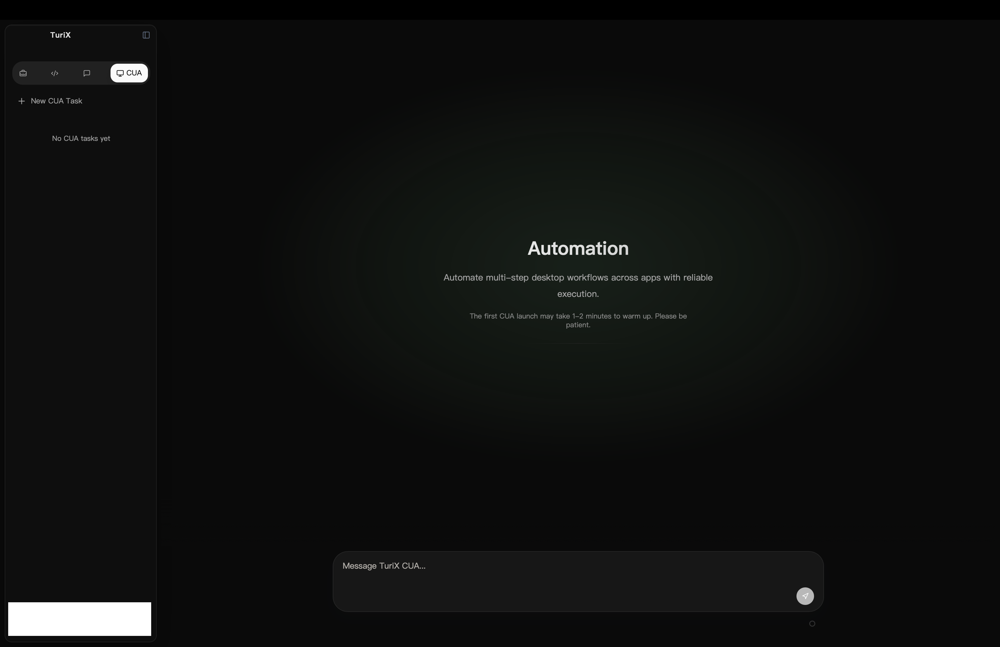

<p align="center">
   
</p>

<h1 align="center">TuriX · AI 驱动的数字牛马</h1>

<p align="center"><strong>描述你的任务给你的电脑，以启动你的数字牛马。</strong></p>

<p align="center">
  <a href="README.md">English</a> | <a href="README.zh-CN.md">中文</a>
</p>

## <a id="contact-community"></a>📞 联系方式与社区

加入我们的 Discord 社区获取支持、讨论与更新：

<p align="center">
   <a href="https://discord.gg/yaYrNAckb5">
      
   </a>
</p>

如果你在github中有网络或其他问题导致无法clone我们的项目，也可以在[AtomGit平台](https://atomgit.com/TuriXAI/TuriX-CUA)上找到我们

如果对我们的项目感兴趣，也欢迎加入我们的微信群：<br>


如微信群无法加入，请直接添加官方小助理：<br>


或通过邮件联系我们：contact@turix.ai

TuriX 让你的强大 AI 模型能在桌面上真正动手操作。
它内置 **最先进的计算机使用Agent**（在我们的 OSWorld 风格 Mac 基准上成功率达到 80%，在 OSWorld 上成功率达到 64.2%），同时保持 100% 开源，并对个人与科研用途免费。

想用你自己的模型？**在 `config.json` 中切换即可。**

## 目录
- [📞 联系方式与社区](#contact-community)
- [🤖 OpenClaw 技能](#openclaw-skill)
- [📰 最新动态](#latest-news)
- [🖼️ 演示](#demos)
- [✨ 关键特性](#key-features)
- [📊 模型性能指标](#model-performance)
- [🚀 快速开始（macOS 15+）](#quickstart-macos-15)
   - [1. 下载应用](#download-app)
   - [2. 创建 Python 3.12 环境](#create-python-env)
   - [3. 授予 macOS 权限](#grant-macos-permissions)
      - [3.1 mac辅助功能](#accessibility)
      - [3.2 Safari 自动化](#safari-automation)
   - [4. 配置并运行](#configure-run)
   - [4.4 Skills（可选）](#skills-optional)
- [🤝 贡献指南](#contributing)
- [🗺️ 开发规划](#roadmap)

---

## <a id="openclaw-skill"></a>🤖 OpenClaw 技能

通过 OpenClaw 使用 TuriX 的 ClawHub 技能：  
https://clawhub.ai/Tongyu-Yan/turix-cua

本仓库也提供本地 OpenClaw 技能包（`OpenCLaw_TuriX_skill/`）：
- `main` 分支提供 macOS 版本（`SKILL.md` + `scripts/run_turix.sh`）
- `multi-agent-windows` 分支提供 Windows 版本（`SKILL.md` + `scripts/run_turix.ps1` + `agents/openai.yaml`）

安装与权限配置请参考 `OpenCLaw_TuriX_skill/README.md`。

---

## <a id="latest-news"></a>📰 最新动态

**2026年 5 月 11 日** - 现在可以在我们的[官网](https://turix.ai)上下载**TuriX超级智能体**。

**2026 年 4 月 8 日** - 🚀 重磅发布 **TuriX SuperPower 3.0.0-alpha**（macOS Apple Silicon）：  
[dmg安装包（仅支持Mac）](https://turix-staging-apollo.sfo3.cdn.digitaloceanspaces.com/turix-app/desktop/releases/Turix-SuperPower_3.0.0-alpha_aarch64.dmg)

这是我们新一代一体化工作应用，把 **TuriX 的 CUA 能力与 CLI 能力**深度融合，并新增两大能力：
- **TuriX-work**：面向办公场景的任务执行与流程编排
- **TuriX-code**：面向开发场景的编码、自动化与工程执行

从写代码到处理办公事务，你可以在同一条工作流里同时获得 CLI 的执行效率与 GUI 的闭环操作能力。

**2026 年 3 月 16 日** - 🐧 **Linux 支持已上线**，位于 `multi-agent-linux` 分支。如果你要在 Linux（如 Ubuntu）上运行 TuriX，请先切换分支：
```bash
git checkout multi-agent-linux
```

**2026 年 3 月 9 日** - 我们在 `mac_legacy` 分支新增了 **OpenClaw 的 macOS Flash/Fast 模式技能包**。如果你要使用这个更快、更轻量的模式，请先切换分支：
```bash
git checkout mac_legacy
```

**2026 年 3 月 5 日** - 我们更新了 `multi-agent-windows` 分支上的 **OpenClaw Windows 本地技能包**，支持更直接的任务分发、更安全的预检查，以及新的 `OpenCLaw_TuriX_skill/agents/openai.yaml` 接口文件。

**更早更新（2026 年 1 月及之前）** - 我们已完成 v0.3 发布（DuckDuckGo、Ollama、可恢复内存压缩、Skills）、发布 TuriX OpenClaw 技能、升级多模型架构，并上线包括 Qwen3-VL 支持与 TuriX API 模型升级在内的多项能力增强。

准备好体验了吗？更新你的 `config.json` 并开始自动化吧——祝你玩得开心！🎉

*欢迎关注我们的 [Discord](https://discord.gg/vkEYj4EV2n) 获取使用技巧、用户故事以及后续的 重磅发布。*

---

## <a id="demos"></a>🖼️ 演示
<p align="center"><strong>TuriX SuperPower App 演示</strong></p>
<p align="center">
   
</p>

<h3 align="center">MacOS 演示</h3>
<p align="center"><strong>预订机票、酒店和 Uber。</strong></p>
<p align="center">
   
</p>

<p align="center"><strong>查询 iPhone 价格，创建 Pages 文档，并发送给联系人</strong></p>
<p align="center">
   
</p>

<p align="center"><strong>在老板通过 Discord 发送的 Numbers 文件中生成柱状图，插入到 PowerPoint 的正确位置，并回复老板。</strong></p>
<p align="center">
   
</p>

<h3 align="center">Windows 演示</h3>
<p align="center"><strong>在 YouTube 搜索视频内容并点赞</strong></p>
<p align="center">
   
</p>

<h3 align="center">与 Claude 的 MCP 演示</h3>
<p align="center"><strong>Claude 搜索 AI 新闻并通过 MCP 调用 TuriX，将研究结果写入 Pages 文档并发送给联系人</strong></p>
<p align="center">
   
</p>

---

## <a id="key-features"></a>✨ 关键特性
| 能力 | 含义 |
|------------|---------------|
| **SOTA 默认模型** | 在 Mac 上的成功率和速度上超越此前的开源Agent（如 UI‑TARS） |
| **无需应用专用 API** | 只要人能点，TuriX 就能点——WhatsApp、Excel、Outlook、内部工具… |
| **可热插拔的「大脑」** | 无需改代码即可替换 VLM 策略（`config.json`） |
| **MCP 就绪** | 可接入 *Claude for Desktop* 或 **任何** 支持 Model Context Protocol (MCP) 的Agent |
| **Skills（Markdown 手册）** | Planner 仅根据名称/描述选择技能，Brain 使用完整技能内容来指导每一步 |

---
## <a id="model-performance"></a>📊 模型性能

我们的 Agent 在桌面自动化任务上达到了业界领先的表现：

### OSWorld 基准测试 — 排行榜第 3 名（50 步）

TuriX 在完整 OSWorld 基准测试中取得 **64.2%（229.88 / 358）** 的成绩，在所有提交的 Agent 中**排名第 3**。值得注意的是，TuriX 专为 **macOS** 打造和优化，在我们自建的 OSWorld 风格 Mac 基准测试中达到了 **80% 以上的成功率**。我们**没有使用任何 Linux 训练数据**，却依然在 OSWorld 的 Linux 环境中取得了前三的成绩。

<p align="center">
   
</p>

<p align="center">
   
</p>

更多细节请查看我们的 [报告](https://turix.ai/technical-report/)。

## <a id="quickstart-macos-15"></a>🚀 快速开始（macOS 15+）

> **我们从不收集数据**——安装、授权，尽情折腾。

> **0. Windows 用户**：请切换到 `multi-agent-windows` 分支获取 Windows 专属的安装与设置说明。
>
> ```bash
> git checkout multi-agent-windows
> ```
>
> 如果你要使用更新后的 OpenClaw Windows 本地技能包，请查看该分支中的 `OpenCLaw_TuriX_skill/README.md`。
>
> **0. Linux 用户**：请切换到 `multi-agent-linux` 分支获取 Linux 专属的安装与设置说明。
>
> ```bash
> git checkout multi-agent-linux
> ```
>
> **0. Windows 旧版用户**：如需此前的 Windows 版本，请切换到 `windows_legacy` 分支。
>
> **0. macOS 旧版用户**：如需此前的单模型 macOS 版本，请切换到 `mac_legacy` 分支。


### <a id="download-app"></a>1. 下载应用
为了更方便使用，[下载应用](https://turix.ai/)

或按下面的手动步骤安装：

### <a id="create-python-env"></a>2. 创建 Python 3.12 环境
首先克隆仓库并运行：
```bash
conda create -n turix_env python=3.12
conda activate turix_env        # requires conda ≥ 22.9
pip install -r requirements.txt
```

### <a id="grant-macos-permissions"></a>3. 授予 macOS 权限

#### <a id="accessibility"></a>3.1 辅助功能
1. 打开 **系统设置 ▸ 隐私与安全性 ▸ 辅助功能**  
2. 点击 **＋**，然后添加 **Terminal** 和 **Visual Studio Code**（或你使用的任何 IDE）
3. 如果运行仍然失败，也请添加 **/usr/bin/python3**

#### <a id="safari-automation"></a>3.2 Safari 自动化
1. **Safari ▸ 设置 ▸ 高级** → 启用 **显示针对 Web 开发者的功能**  
2. 在新出现的 **开发** 菜单中启用  
    * **允许远程自动化**  
    * **允许来自 Apple Events 的 JavaScript**  

##### 触发权限对话框（每个 shell 运行一次）
```
# macOS 终端
osascript -e 'tell application "Safari" to do JavaScript "alert("Triggering accessibility request")" in document 1'

# VS Code 集成终端（重复一次以授权 VS Code）
osascript -e 'tell application "Safari" to do JavaScript "alert("Triggering accessibility request")" in document 1'
```

> **在每个弹窗中点击“允许”**，这样Agent才能驱动 Safari。

### <a id="configure-run"></a>4. 配置并运行

#### 4.1 编辑任务配置

> [!IMPORTANT]
> **任务配置非常关键**：任务指令的质量直接影响成功率。清晰、具体的提示会带来更好的自动化效果。

在 `examples/config.json` 中编辑任务：
```json
{
    "agent": {
         "task": "open system settings, switch to Dark Mode"
    }
}
```

#### 4.2 编辑 API 配置

从我们的[官网](https://turix.ai/api-platform/)获取 API。
登录网站，密钥在页面底部。

在这个 main（multi-agent）分支，你需要同时配置 brain、actor 和 memory 模型；目前该特性仅支持苹果电脑。如果开启规划（`agent.use_plan: true`），还需要配置 planner 模型。
我们强烈建议你将 turix-actor 模型作为 actor。brain 可以使用你喜欢的任意 VLM，我们的API平台也提供Gemini-3-flash和turix-brain作为brain，适合大多数任务。

在 `examples/config.json` 中编辑 API：
```json
"brain_llm": {
      "provider": "turix",
      "model_name": "turix-brain",
      "api_key": "YOUR_API_KEY",
      "base_url": "https://turixapi.io/v1"
   },
"actor_llm": {
      "provider": "turix",
      "model_name": "turix-actor",
      "api_key": "YOUR_API_KEY",
      "base_url": "https://turixapi.io/v1"
   },
"memory_llm": {
      "provider": "turix",
      "model_name": "turix-brain",
      "api_key": "YOUR_API_KEY",
      "base_url": "https://turixapi.io/v1"
   },
"planner_llm": {
      "provider": "turix",
      "model_name": "turix-brain",
      "api_key": "YOUR_API_KEY",
      "base_url": "https://turixapi.io/v1"
   }
```

如果要使用本地 Ollama，请将各个角色指向你的 Ollama 服务：
```json
"brain_llm": {
      "provider": "ollama",
      "model_name": "llama3.2-vision",
      "base_url": "http://localhost:11434"
   },
"actor_llm": {
      "provider": "ollama",
      "model_name": "llama3.2-vision",
      "base_url": "http://localhost:11434"
   },
"memory_llm": {
      "provider": "ollama",
      "model_name": "llama3.2-vision",
      "base_url": "http://localhost:11434"
   },
"planner_llm": {
      "provider": "ollama",
      "model_name": "llama3.2-vision",
      "base_url": "http://localhost:11434"
   }
```

#### 4.3 配置自定义模型（可选）

如果你想使用 build_llm 函数中未定义的其他模型，需要先在代码中定义，再在配置中设置。

main.py:

```
if provider == "name_you_want":
        return ChatOpenAI(
            model="gpt-4.1-mini", api_key=api_key, temperature=0.3
        )
```
请根据你的 LLM 在 ChatOpenAI、ChatGoogleGenerativeAI、ChatAnthropic 或 ChatOllama 之间切换，并修改对应的模型名称。

#### <a id="skills-optional"></a>4.4 Skills（可选）

Skills 是放在单一文件夹中的 Markdown 手册（默认 `skills/`）。每个技能文件以 YAML frontmatter 开头，包含 `name` 和 `description`，后面是操作说明。Planner 只读取名称与描述来选择技能；Brain 会读取完整内容来指导每一步的目标生成。
Skills 选择需要开启规划功能（`agent.use_plan: true`）。

示例技能文件（`skills/github-web-actions.md`）：
```md
---
name: github-web-actions
description: 用于在浏览器中操作 GitHub（搜索仓库、点 Star 等）。
---
# GitHub Web Actions
- 打开 GitHub，使用站内搜索并进入仓库页面。
- 若需要登录，先向用户确认再继续。
- 在继续之前确认 Star 按钮状态。
```

在 `examples/config.json` 中启用：
```json
{
  "agent": {
    "use_plan": true,
    "use_skills": true,
    "skills_dir": "skills",
    "skills_max_chars": 4000
  }
}
```

#### 4.5 启动Agent

```bash
python examples/main.py
```

**享受免手操作的计算体验 🎉**

#### 4.6 恢复已中断的任务

如果任务中断，想从上次位置继续，请在 `examples/config.json` 中设置固定的 `agent_id` 并开启 `resume`：
```json
{
    "agent": {
         "resume": true,
         "agent_id": "my-task-001"
    }
}
```
注意：
- 使用与你要恢复的运行相同的 `agent_id`。
- 恢复时请保持同一个 `task`。
- 只有在 `src/agent/temp_files/<agent_id>/memory.jsonl` 已存在时才会生效。
- 想重新开始：将 `resume` 设为 `false`、更换 `agent_id`，或删除 `src/agent/temp_files/<agent_id>`。

## <a id="contributing"></a>🤝 贡献指南

我们欢迎贡献！请阅读我们的 [Contributing Guide](CONTRIBUTING.MD) 了解如何开始。

快速链接：
- [开发环境配置](CONTRIBUTING.MD#development-setup)
- [代码风格指南](CONTRIBUTING.MD#code-style-guidelines)
- [测试](CONTRIBUTING.MD#testing)
- [Pull Request 流程](CONTRIBUTING.MD#pull-request-process)

如果你发现 bug 或有功能需求，请 [提交 issue](https://github.com/TurixAI/TuriX-CUA/issues)。

